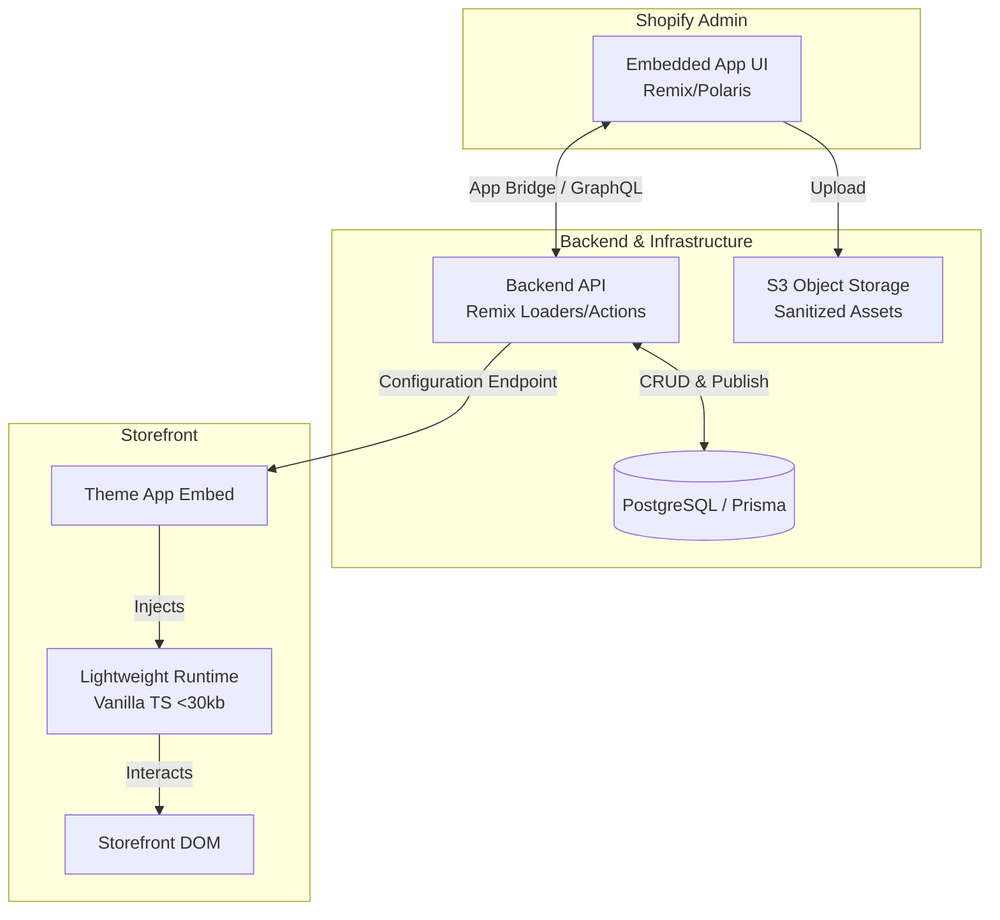

# Architecture & Design Specification: Brand Interaction Engine

## 1. Executive Overview

This document outlines the architecture for the **Brand Interaction Engine**, a production-ready Shopify App. Built on Remix / React Router, Shopify App Bridge, Polaris, Prisma (PostgreSQL), and an isolated, lightweight storefront runtime embedded via Shopify Theme App Extensions, it allows merchants to create high-performance, branded storefront interactions.

This is fundamentally an extensible, configuration-driven interaction engine, not just a "custom cursor app." It is designed with strict separation between admin configuration, secure backend storage, and a hyper-performant, fail-open storefront runtime.

---

## 2. Foundational Architecture



---

## 3. Core Architectural Principles

1.  **Storefront Independence & Performance:** The storefront runtime (`brand-interaction.js`) operates completely isolated from the Admin UI. It is built in pure Vanilla TypeScript, zero-dependency, and must remain `< 30 KB` compressed. It uses hardware-accelerated CSS transforms (`transform: translate3d`) and `requestAnimationFrame`, never loading React or heavy libraries onto the merchant's storefront.
2.  **Fail-Open Design:** Commerce must never be blocked. If backend API calls fail, configuration times out, or an animation throws an error, the storefront degrades silently to standard native browser cursors and interactions with zero runtime crashes.
3.  **Strict Multi-Tenancy:** Every database query must explicitly verify ownership (e.g., `resource.shopId = authenticatedShop.id`). All models (`Experience`, `BrandProfile`, `Asset`, `Analytics`) are scoped to the `shopId` authenticated via the Shopify OAuth session.
4.  **Declarative Engine & Security:** Merchants can only configure declarative rules (e.g., `CHANGE_CURSOR`, `RIPPLE`, `SCALE`) via a strongly-typed JSON schema (validated via Zod). Arbitrary JavaScript execution (no `eval()` or `new Function()`) is strictly prohibited. Uploaded SVGs are aggressively sanitized.
5.  **Accessibility & Reduced Motion:** The system automatically respects OS-level `prefers-reduced-motion: reduce` settings (disabling trails, snapping, heavy effects), adapts to touch device capabilities (via `PointerInteractionEngine`), and ensures all cursor DOM elements use `pointer-events: none`. A global "Disable Experience" toggle must be available.
6.  **Immutable Publishing:** The storefront *never* reads draft configurations. The backend compiles drafts into immutable, versioned JSON artifacts for the storefront to consume.

---

## 4. System Components

### 4.1 Admin Shell (`/app`)

The Admin Dashboard provides the configuration interface for merchants.

*   `/app/routes/app._index.tsx`: Main Dashboard (Active experience status, quick customization, quick metrics).
*   `/app/routes/app.brand.tsx`: Brand Kit Configuration (Logo, primary/accent colors, visual style).
*   `/app/routes/app.experiences._index.tsx`: Experience List & Management.
*   `/app/routes/app.experiences.new.tsx`: Create Experience / Template Picker.
*   `/app/routes/app.experiences.$id.tsx`: Experience Editor with Live Interactive Preview (General, Cursor, Hover, Click, Trail, Rules, Accessibility).
*   `/app/routes/app.templates.tsx`: Browsable Experience Templates Catalog.
*   `/app/routes/app.analytics.tsx`: Privacy-focused Interaction Metrics & Analytics (Feature-flagged).
*   `/app/routes/app.settings.tsx`: Feature Flags, Preferences & Account Settings.
*   `/app/routes/app.billing.tsx`: Billing & Plan Entitlements (FREE, STARTER, GROWTH, PRO).

### 4.2 Backend API Routes & Data Layer

*   **Database (Prisma/PostgreSQL):** Models for `Shop`, `BrandProfile`, `Experience`, `ExperienceVersion`, `ExperienceRule`, `Asset`, `AnalyticsSession`, `AnalyticsEvent`, `AnalyticsDailyMetric`.
*   **Public API Route:** `GET /storefront/config` serves cached, published JSON for the active experience. Uses ETag/versioning.
*   **Admin API Routes:** CRUD operations handled via Remix Loaders and Actions for Shop, Brand, Experiences, Rules, etc.
*   **Asset Endpoint:** `POST /api/assets` validates MIME type, file size, dimensions, and sanitizes SVG files before storage.
*   **Analytics Endpoint:** `POST /analytics/events` receives local aggregations/small batches of interaction events from the storefront (no raw mouse coordinates).

### 4.3 Storefront Integration (`extensions/brand-interaction`)

*   **App Embed Block:** `blocks/brand_interaction.liquid` injects the necessary bootstrap script to fetch `/storefront/config`. No business logic resides in Liquid.
*   **Storefront Runtime Script:** A bundled Vanilla TS module that handles:
    *   `PointerInteractionEngine`: Detects desktop vs. touch capabilities.
    *   `CursorEngine` & `CursorRenderer`: Manages cursor states (Default, Dot, Ring, Crosshair, Image, SVG, Emoji).
    *   `RuleEngine`: The core engine evaluating logic: `EVENT` ➡️ `CONTEXT` ➡️ `MATCH RULES` ➡️ `PRIORITY SORT` ➡️ `EXECUTE ACTION` ➡️ `STATE UPDATE`.
    *   `ElementDetector`: Uses fallback strategies (Semantic, Shopify signals, Safe selectors) to identify targets like `ADD_TO_CART` or `PRODUCT_IMAGE` without relying on fragile CSS.

---

## 5. Data Models (PostgreSQL + Prisma)

*All tenant-owned tables must relate back to `Shop` via `shopId`.*

| Entity | Primary Fields | Purpose |
| :--- | :--- | :--- |
| **Shop** | `id`, `shopifyShopId`, `shopDomain`, `plan` | Tenant root, handles authentication status and active billing plan. |
| **BrandProfile** | `shopId`, `logoUrl`, `primaryColor`, `style` | Global brand identity used as default values for experiences. |
| **Experience** | `shopId`, `draftConfiguration` (JSONB), `status` | Container for interactions. `draftConfiguration` is mutable by the admin. |
| **ExperienceVersion**| `experienceId`, `configuration` (JSONB), `version` | Immutable state created upon publish. The storefront only ever reads these. |
| **ExperienceRule** | `experienceId`, `condition` (JSONB), `action` (JSONB) | Individual interaction logic (e.g., "On product image hover, change to magnifying glass"). |
| **Asset** | `shopId`, `storageKey`, `cdnUrl`, `type`, `mimeType` | Records for sanitized, uploaded files (cursors, logos). |
| **AnalyticsSession** | `shopId`, `deviceType`, `startedAt` | Anonymous tracking (No PII, no customer ID links in V1). |
| **AnalyticsEvent** | `eventType`, `pageType`, `elementType` | Aggregated, meaningful interactions (e.g., `element_hover`, not raw x/y tracking). |

### 5.1 Configuration Schema Example
The JSON payload generated by the backend and validated by Zod:

```json
{
  "schemaVersion": 1,
  "cursor": {
    "type": "ring",
    "size": 18,
    "color": "#D4AF37",
    "blendMode": "normal"
  },
  "rules": [
    {
      "condition": { "type": "element", "target": "add-to-cart" },
      "action": { "type": "change_cursor", "cursor": "shopping-bag" }
    }
  ]
}
```

---

## 6. System Workflows

### 6.1 The Publishing Flow
1.  Merchant edits **Draft Configuration** in the Admin UI (Live preview updates locally via React state).
2.  Merchant clicks "Publish".
3.  Backend API validates draft against the Zod schema.
4.  Backend compiles the draft into a new immutable **ExperienceVersion**.
5.  Backend marks the draft as published and invalidates edge caches.
6.  The Storefront fetches the new version via the public `/storefront/config` endpoint.

### 6.2 The Rule Engine Flow
Instead of hardcoding hover effects, the runtime evaluates declarative rules based on merchant configuration.

1.  **Event:** `mouseenter` on an element.
2.  **Context:** The `ElementDetector` resolves the element type (e.g., `product-card`) once and caches the classification.
3.  **Match:** Evaluate all rules matching the context.
4.  **Precedence:** Resolve conflicts deterministically (Product Rule > Collection > Element > Page > Global > Default).
5.  **State Update:** The `CursorEngine` transitions to the new state (e.g., `DEFAULT` ➡️ `HOVER`) and updates the `CursorRenderer`.

---

## 7. Security & Privacy

### 7.1 Data Privacy (V1)
*   **No PII Collected:** Customer identity, order data, IP addresses, and exact mouse trajectories are **not** collected or stored.
*   **Event Aggregation:** The storefront batches interaction events (e.g., `experience_loaded`, `effect_triggered`) locally before sending them in small batches to the backend.
*   **Minimal Scopes:** The app requests only the absolute minimum required Shopify OAuth scopes.

### 7.2 Execution Environment
*   No arbitrary JavaScript execution allowed from the merchant dashboard.
*   All interactions are mapped to predefined, safe runtime functions.
*   Never trust client-provided `shopId`s; determine identity strictly from the authenticated Shopify session.

---

## 8. Future Extensibility (V2+)

The engine is structured to support future modules without rewriting the V1 core:

*   **Renderer Interfaces:** Built to allow future integration of `HoverRenderer`, `MotionRenderer`, and `EffectRenderer`.
*   **A/B Testing Architecture:** The `Experience` model supports branching variants for traffic allocation.
*   **Analytics & Heatmaps:** Future interaction scoring based on meaningful hover interactions and viewport buckets, rather than raw trajectory mapping.
*   **AI Optimization:** An `ExperienceRecommendationService` boundary is planned to ingest brand profiles and analytics to output validated JSON configurations.